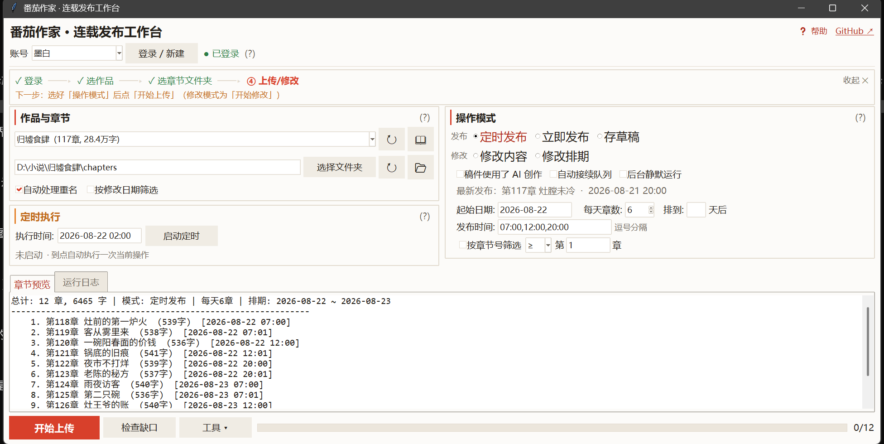

# 番茄作家批量上传工具

> 把本地章节批量发到番茄作家：一次排完几个月的更新，每章都核对是否真的发出去。

[](LICENSE)

[⬇ 下载 ZIP](https://github.com/rockbenben/fanqie-publisher/archive/refs/heads/main.zip) · [📖 快速开始](#快速开始) —— 需自备 Python 3.10+



选好章节文件夹，工具自动解析章节号、清洗 Markdown 格式、按你设定的时间表逐章发布。番茄的章节顺序只认创建顺序、漏发的章补不回原位，所以每发一章都会回平台核对，漏了当场停下并给出可直接粘贴的补传章节号。

## 支持范围

| 项目 | 支持情况 |
| ---- | -------- |
| 平台 | 仅番茄小说「作家助手」网页版，其他小说平台不支持 |
| 系统 | Windows / macOS / Linux |
| 运行环境 | Python 3.10+（Linux 另需 `sudo apt install python3-tk`） |
| 章节文件 | `.md` / `.txt`，含子文件夹，按文件夹名 → 文件名自然排序 |
| 章节号识别 | 第X章 / 回 / 节 / 话（中文数字也认）、数字前缀、`chapter-N` |
| 分卷作品 | 支持，可按卷筛选或「合并所有卷」一次操作全部章节 |
| 多账号 | 支持，顶部下拉框一键切换，各账号独立记忆上次选的作品 |

## 能做什么

- **五种模式** — 定时发布 / 立即发布 / 存草稿 / 修改内容 / 修改排期
- **自动排期** — 多时间点（`08:00,12:00,20:00`）均匀分配，同一天内严格保序，临近午夜会整体前移而不乱序
- **接着上次往后排** — 自动从平台队列末尾的次日接着排，且只发平台上还没有的章
- **逐章核对** — 每发一章回平台确认真的存在；整批跑完再拉一次真实章节列表对账
- **两种筛选** — 按章节号（`≤30`、`5-10`、`1,3,5-10`）或按文件修改时间
- **缺口体检** — 一键查全书错位；未公开那段能自动改写修复，已公开的列出还剩几小时可救

## 快速开始

三步：

1. 装 [Python 3.10+](https://www.python.org/downloads/)（Windows 安装时勾选 **Add Python to PATH**）
2. **Windows** 双击 `run.bat`；**macOS / Linux** 终端跑 `bash run.sh`
3. 点「登录 / 新建」→ 浏览器里登录番茄账号 → 回界面选作品 → 选章节文件夹 → 开始上传

首次运行会自动装依赖和浏览器内核，之后直接启动。启动脚本每次都会幂等校验内核，缺失或版本不对会自动补装。

Windows 下环境就绪时**不弹命令行窗口**，只出 GUI；需要装东西时才弹安装进度窗口。排查问题用 `run.bat debug` 保留控制台输出，程序异常退出会自动用记事本打开启动日志。

## 使用指南

首次打开会弹**新手引导**；主界面顶部还有一条引导栏，按「登录 → 选作品 → 选章节文件夹 → 上传/修改」实时高亮当前步骤。引导栏可收起，之后点「❓帮助」重看，各区块旁的 `(?)` 有单独说明。

### 登录

点「登录 / 新建」，填一个**本地账号名称**（如 `作家A`，只用来区分多个账号，不是番茄笔名），浏览器自动打开登录页，主窗口最小化避让，右下角出现浮动提示窗。

> ⚠️ 登录完成后请先点绿色的「登录完成，保存会话」**再**关浏览器。先关浏览器会导致会话读不到，工具会明确报错要求重新登录，不会把旧账号的会话错存到新名字下。

登录期间上传、刷新作品、切换账号、定时触发都会暂避，等登录结束再继续——避免两个浏览器同时读写登录状态。

### 五种模式

| 模式 | 做什么 | 需要本地文件 |
| ---- | ------ | :----------: |
| **定时发布** | 按起始日期、每天章数、发布时间自动排期 | 是 |
| **立即发布** | 上传后直接发布 | 是 |
| **存草稿** | 上传后存草稿，之后手动逐章发布 | 是 |
| **修改内容** | 按章节号匹配已有章节替换正文，不动发布时间 | 是 |
| **修改排期** | 批量改平台上「待发布」章节的日期/时间，不动正文 | 否 |

前三种是**新建**章节，后两种是**改写**已有章节——失败策略因此完全不同，见[各模式的失败策略](#各模式的失败策略不一样)。

定时发布、立即发布、修改内容可勾「稿件使用了AI创作」，对应番茄的 AI 申报选项，请如实勾选。

### 排期怎么算

- 起始日期自动建议为「队列排到哪天」的次日（含待发布章，不是只看已发布的）
- 每天章数大于时间点数时，章节均匀分配到各时段，同时段内按 +1 分钟递增
- **同一天内严格按章节顺序递增**：`23:58` 排 3 章会整体前移到 `23:57/23:58/23:59`，不会后面的章反而先发
- 勾「接着上次往后排」则不用自己填起始日期、也不用挑章节：工具去平台看已经排到哪天，从次日接着往后排，且**只发平台上还没有的章**（本地已发过的自动跳过）。旁边「排到 N 天后」留空 = 全排上去，填 N = 只排到那天为止。预览面板会直接列出实际要发的章和日期

> **例：** 每天 6 章、时间 `07:00,12:00,20:00` → `07:00, 07:01, 12:00, 12:01, 20:00, 20:01`

### 筛选

**按章节号**（所有模式都有）支持三种写法：单个数字 `30` 配合 `≤`/`≥` 做阈值；范围 `5-10`；逗号组合 `1,3,5-10`。用范围或组合时运算符自动置灰。被跳过的章在预览底部汇总（如 `[跳过 3 章: 3 筛选]`）。

**按修改日期**勾选后可选「早于」/「晚于」某时间点（「晚于」含边界，「早于」不含），格式 `YYYY-MM-DD HH:MM` 或 `YYYY-MM-DD`。格式错会红字拦下，不会静默忽略。

两种筛选的命令行等价物 `--chapters` / `--modified-after` / `--modified-before` 与界面**共用同一个解析器**——失败汇总给的章节号在两个入口粘贴效果完全一样。

### 跑起来之后

界面下方选项卡切「章节预览」和「运行日志」。点「开始上传」后自动切到日志页，所有控件锁定，点「停止」可随时中断。

> 中断请用「停止」。直接关浏览器也会停下并照常给汇总，尚未处理的章节一并记入清单（含可直接补传的章节号），不会被静默漏掉，只是在途那一章可能处于中间状态。

**批次结束会自动对账**：拉平台真实章节列表，核对每个「日志记成功」的章是否真的存在，对不上的报「⚠ 对账发现 N 章日志记成功但平台上没有」并计入补传清单。存草稿模式改用草稿箱接口对账（草稿不进章节管理页，比不了那张表），能直接列出被覆盖丢失的是哪几章。

### 定时执行

填执行时间（`YYYY-MM-DD HH:MM`）点「启动定时」，到点自动执行当前所选模式，仅触发一次。启动前会检查登录状态、有没有选作品、有没有可操作章节。到点时若已有任务在跑会等它空闲，不丢弃本次定时；触发前约 60 秒会自动刷新一次章节目录。定时期间请保持程序运行。

## 章节顺序与缺口

番茄的章节顺序有一条**反直觉但必须知道**的规则（2026-08-20 实测确认）：

> **目录顺序 = 章节在卷内的位置（创建追加顺序），不是标题里的「第N章」，也不是发布时间。**

平台的章节接口里根本没有「章节号」这个字段——编辑器里「第 __ 章」填的值只是拼进标题字符串。所以**新建的章一律追加到全书末尾**，网页端没有任何插入、排序、拖拽入口。

后果是：**中途漏发的章补不回原位**。你把第 709 章补上去，哪怕定时到它原本该发的时刻，它也会排在全书最后，读者看到的是「第 708 章 → 第 710 章 →（全书末尾）第 709 章」。

**唯一的补救**是在**手机 App** 里「申请调整 → 审批通过 → 单章选中 → 移动位置」，且**只对发布 3 天内的章有效**，超期即永久错位。

因此工具的策略是尽早发现、能自动修的自动修。点主界面「**检查缺口**」出体检报告（只读，不改任何东西）：

| 段 | 判据 | 谁来修 |
| -- | ---- | ------ |
| **A** | 未公开（待发布）、位置与章号不符 | 工具自动改写内容，排期不变 |
| **B** | 已公开、发布在 3 天内、顺序倒挂 | 只能你去手机 App 申请移动；工具列出章号和**剩余窗口小时数** |
| **C** | 已公开、超过 3 天 | 永久错位，只登记不再提示 |

**多卷作品：** 章节列表接口一次只返回一卷，`index` 是 `卷序号×10000 + 卷内位置`（实测：卷1 `1~100`、卷2 `10001~10150`、卷3 `20001~20115`）。工具遍历每一卷合并成全书视图，位置按全书连续换算——所以对账覆盖全书，不会把别卷的章误判成「平台上没有」。

### 各模式的失败策略不一样

判据是**失败可不可逆**：

| 模式 | 动作 | 漏一章的后果 | 策略 |
| ---- | ---- | ---- | ---- |
| 定时发布 / 立即发布 | 新建章节 | **永久缺口**（补上去只会吊在书尾） | 逐章确认新章真落地；确认不到或提交失败 → **中止整批** |
| 存草稿 | 新建草稿 | 草稿丢失，不影响正文顺序 | 连续 3 章不明失败才熔断 |
| 修改内容 / 修改排期 | 改已有章节 | 内容/排期还是旧的，重来即可 | 单章失败记入清单、继续；重名冲突留待批末二次尝试 |

新建类中止后不必慌：**停在队尾是无害的**，按汇总给的补传章节号接着发即可。真正危险的是「跳过失败那章继续发」——那会把缺口永久卡在中段。

**未公开段怎么修：** 让位置 *i* 的章装第 *i* 章的内容。原来的中段缺口会变成「队列末尾少排了 N 章」，之后正常上传接着往后排即可——洞不是补上的，是被推到队尾消失的。底部的「章节重排」按钮，只动「待发布」的章、跳过 60 分钟内就要发的、按位置升序处理，中途停在哪都是「单调有洞」，不会乱序或重复。

### 清空草稿箱

番茄在编辑器里填正文时会自动存草稿，历史上定时发布的假成功 bug 每次都留下一份孤儿草稿（748 章那次漏 151 章，草稿箱同源堆了 241 条）。这些草稿本地都有源文件，可以放心清掉。

底部的「清空草稿箱…」删之前会强制做一次**安全检查**：每条草稿的章号必须在本地目录里有对应文件，有任何一条对不上就拒绝执行（有正文却没有章号的草稿同样拦下）——那说明这份内容只存在于草稿里，删了就没了。

## 已知限制

- **漏发的章补不回原位**（网页端）。只有手机 App 能在发布 3 天内申请移动，超期永久错位。这也是工具宁可中止整批也不跳章继续的原因。
- **发布字数有平台上限，分每日和每月两档。** 撞上后工具立即中止整批（继续提交只会重复撞限），当前章和所有剩余章节记入清单，按章节号补传即可。日志会写明撞的是哪一档——**每日**次日再跑，**每月**得等下月额度重置，「明天再来」不管用。
- **不支持自动断点续传。** 但结束汇总会把未成功的章压成一段章节号（如 `79-114`），粘回「按章节号筛选」就能只补这些。
- **距定时发布不足 30 分钟时提交的修改可能不生效**（平台规则）。即使日志显示「已保存修改」，临近发布时间的章节建议抽查确认。
- **登录必须有头浏览器。** 其余步骤可勾「后台静默运行」，登录这一步要你本人操作，不能无头。
- **多卷作品各自从 1 编号时不要勾「合并所有卷」。** 本地章节号重复时只取首个文件，其余跳过并在日志列出重复号，请按卷分别操作。

## 常见问题

**点「登录 / 新建」、填了名称后没反应？** 最常见是**浏览器内核（chromium）没装上**——`playwright` 这个 Python 包和它驱动的 chromium 是两个独立部分。启动脚本会幂等校验并自动补装；万一仍缺，点登录会弹窗提示「缺少浏览器内核」，可一键下载，或手动跑 `python -m playwright install chromium`。

**日志说发成功了，平台上却没有这一章？** 这是最危险的一类故障——曾经一批 748 章的定时发布，日志记「成功 736」，平台实际少了 151 章，三周后才发现，那时早已超过手机 App 的 3 天窗口，全部永久错位。根因是把「确认发布按钮消失」当成提交成功，而对话框被异常关闭时按钮同样会消失。现在有两道防线：单章要拿到接口 `code=0` 或页面跳回章节管理页才算成功；整批跑完再拉平台真实列表对账。出现「⚠ 对账发现 N 章日志记成功但平台上没有」就用清单里的章节号补传，**越快越好**。

**提示「本书中存在重复标题，请修改后再发布」？** 分两种：**标题搬移的临时冲突**（常见）——本地重新编号把标题从一章挪到另一章，新章先于旧章提交同名标题被拒，工具会自动留待批末二次尝试，通常无需干预；**真正撞名**——与本次批量之外的章节同名，需在平台手动改掉其一再补传。

**任务跑完了，界面却像卡住一样？** 个别情况下浏览器子进程会卡在退出阶段（实测曾长达 41 分钟）。章节其实早已提交成功，只是收尾被拖住。工具已对关闭浏览器、保存登录状态等收尾步骤加了超时保护，关不掉就放弃等待，汇总立即给出。日志出现「关闭浏览器超过 N 秒未完成」属于此情况，不影响结果。

**上传失败怎么排查？** 按顺序看：① 结束汇总里的「失败章节及原因」清单；② 日志里的 `页面提示: `（失败瞬间捕获的平台弹窗原文，超时类还附页面 URL 和按钮状态）；③ 项目目录下的错误截图（如 `error_0_chapter-039.png`）；④ `fanqie_error.log` 全过程日志。如果 `页面提示` 里出现了工具不认识的失败文案，欢迎反馈以便补充识别词库。

**登录状态过期 / 想换账号？** 点「登录 / 新建」输入对应账号名重新登录，会问是否覆盖旧状态。登录状态分别存在 `.auth_账号名.json`。状态文件损坏（如进程被强杀留下半截文件）时工具自动忽略并提示重登，不会启动失败。

## MD 文件格式

每个 MD 或 TXT 文件对应一个章节：

```markdown
# 第 39 章 安定期

一周后。

周六下午两点。
```

**首行**的 `# 标题` 用于提取章节号和标题；首行不是 `# 标题` 时从文件名提取。正文中部出现的 `# ` 行按正文处理（只去掉 `#` 记号、保留文字），不会截断内容。正文里的 Markdown 标记会自动去除（加粗、斜体、标题、引用、列表、代码块、HTML 标签等），但颜文字 `(>_<)`、比较符号 `体温>38` 不会被误删。

| 文件名格式 | 示例 | 章节号 | 标题 |
| ---- | ---- | :----: | ---- |
| 数字前缀 | `001_新的旅程.md` | 1 | 新的旅程 |
| 数字+冒号 | `001：新的旅程.md` | 1 | 新的旅程 |
| 第X章（数字） | `第27章_重新开始.md` | 27 | 重新开始 |
| 第X章（中文） | `第十六章 发布会.txt` | 16 | 发布会 |
| 第X回 | `第二十七回 黛玉葬花.md` | 27 | 黛玉葬花 |
| 第X话/节 | `第16话 出发.md` | 16 | 出发 |
| chapter-N | `chapter-039.md` | 39 | _(从文件内 `#` 标题提取)_ |
| 纯文字 | `安定期.md` | _(无)_ | 安定期 |

## 命令行用法

> 🛠️ **进阶** —— 只用图形界面的话可以跳过整节。GUI 里的每项功能命令行都有对应入口，两边参数一一对齐。想改代码或跑测试见 [CONTRIBUTING.md](CONTRIBUTING.md)。

```bash
python fanqie_upload.py login                 # 登录并保存会话
python fanqie_upload.py books                 # 列出你的作品及 Book ID

# 上传（默认仅存草稿）
python fanqie_upload.py upload ./chapters --book-id <ID>

# 定时发布：从 9-01 起每天 2 章，三个时间点（日期换成你自己的）
python fanqie_upload.py upload ./chapters --book-id <ID> \
  --schedule 2026-09-01 --per-day 2 --time 08:00,12:00,20:00

python fanqie_upload.py upload ./chapters --book-id <ID> --publish   # 立即发布
python fanqie_upload.py upload ./chapters --book-id <ID> --edit      # 修改已有章节内容

# 补传：把上次失败汇总给的章节号原样粘进来
python fanqie_upload.py upload ./chapters --book-id <ID> --chapters 79-114

# 自动接续：从平台队列末尾往后排，只补到今天+7 天
python fanqie_upload.py upload ./chapters --book-id <ID> --auto-continue --days-ahead 7

# 批量改排期：所有「待发布」章节从 9-01 起每天 6 章（加 --all-volumes 合并多卷）
python fanqie_upload.py reschedule --book-id <ID> --schedule 2026-09-01 --per-day 6

python fanqie_upload.py audit                 # 缺口体检（只读）
python fanqie_upload.py audit --daily         # 无人值守体检，发现问题弹窗
python fanqie_upload.py remap                 # 预览重排计划（只读）
python fanqie_upload.py remap --run           # 真的改写
python fanqie_upload.py clean-drafts          # 草稿箱预览 + 安全检查
python fanqie_upload.py clean-drafts --run    # 真的删
```

`remap` / `clean-drafts` **默认只预览**，加 `--run` 才真写。`remap` 另有 `--only N`（灰度改一个）、`--range A-B`、`--limit N`、`--safety-minutes N`（跳过 N 分钟内就要发布的章，默认 60）。`clean-drafts` 的 `--force` 可跳过安全检查强删，**草稿删掉没有回收站**，只在确认那些本地找不到源文件的草稿确实不要了再用。

`--book-id` 默认取 `.gui_state.json`，`--content-dir` 默认取 `config.json`；`--headless` / `--show-browser` 覆盖配置里的无头设置。完整参数见 `python fanqie_upload.py -h`。

> ⚠️ **挂成定时任务时强烈建议显式传 `--book-id` 和 `--content-dir`。** 不传时它们取「上次在 GUI 里选的作品」和配置里的章节目录——**你在 GUI 里切一次作品，今晚的定时任务就换了目标**。工具在真写入前会做一次归属校验（拿平台已发布章的标题跟本地同章号文件比对），对不上就中止且不做任何改动；但显式指定才是根治。
>
> Windows 计划任务用 `pythonw.exe "<仓库>\fanqie_upload.py" audit --daily`（`pythonw` 无控制台窗口）；macOS / Linux 用 `crontab -e` 加 `10 0 * * * cd <仓库> && python3 fanqie_upload.py audit --daily`。

## 配置文件

`config.json` 首次运行自动生成，GUI 会把部分设置写回：

| 字段 | 说明 | 默认值 |
| ---- | ---- | ------ |
| `delay_between_chapters` | 章节间等待秒数 | `3` |
| `headless` | 后台静默运行（GUI 同名勾选框写回） | `false` |
| `max_retries` | 单章失败最大重试次数 | `2` |
| `default_mode` | 默认模式（`schedule`/`publish`/`draft`/`edit`/`reschedule`） | `schedule` |
| `default_per_day` | 默认每天章数 | `2` |
| `default_time` | 默认发布时间，多个用逗号分隔（支持 `8:00` 简写） | `08:00` |
| `browser_timeout` | 浏览器操作超时（毫秒，最小 1000；更小的值视为误填秒数并回退默认） | `15000` |
| `chapters_dir` | 章节文件夹路径 | `chapters/` |
| `auto_continue` | 定时发布是否自动接续平台队列 | `false` |
| `days_ahead` | 自动接续只补到「今天 + N 天」；`null` = 全排上 | `null` |
| `auto_unique` | 是否自动处理重名章节 | `true` |
| `use_ai` | 是否申报「使用 AI 创作」 | `false` |

GUI 还会往这里写几个纯界面状态（`timer_time`、`resched_filter_*`）用于恢复上次的选择，不需要手工编辑。
